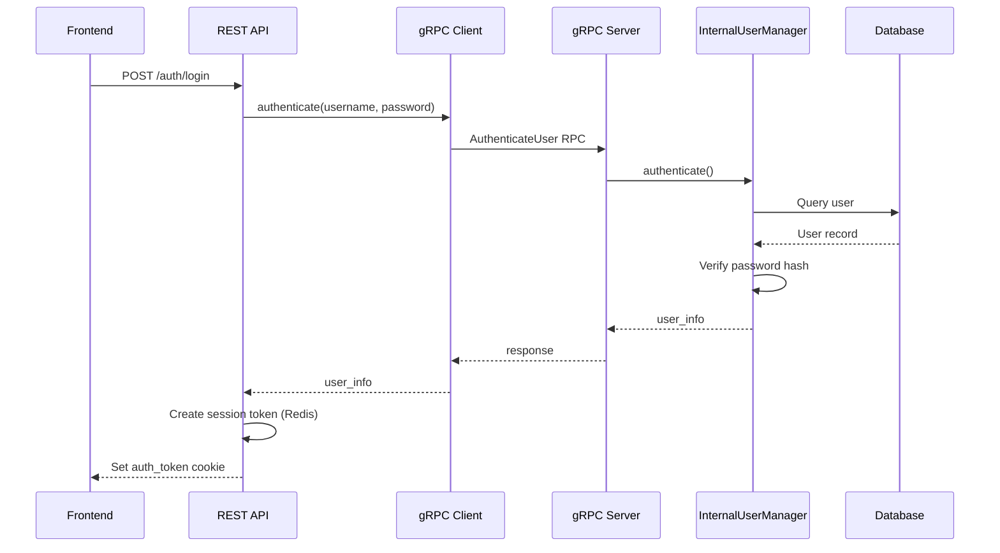

# Internal User Manager Documentation

## Overview

The Internal User Manager is a core component of {{ module_name }} that provides local user authentication and authorization when no external usermanager module is available.

## Architecture

```
┌──────────────────────────────────────────────────────────┐
│                    {{ module_name }}                      │
├──────────────────────────────────────────────────────────┤
│                                                          │
│  ┌────────────────────────────────────────────────────┐  │
│  │  User Manager (TaskManager Task)                   │  │
│  ├────────────────────────────────────────────────────┤  │
│  │  • InternalUserManager (Business Logic)            │  │
│  │  • UserManagerGrpcServer (gRPC Service)            │  │
│  │  • Runs as separate asyncio task                   │  │
│  └────────────────────────────────────────────────────┘  │
│                          │                               │
│                          │ gRPC Unix Socket              │
│                          ↓                               │
│  ┌────────────────────────────────────────────────────┐  │
│  │  REST API (FastAPI)                                │  │
│  ├────────────────────────────────────────────────────┤  │
│  │  • AuthenticationService                           │  │
│  │  • UserManagerGrpcClient                           │  │
│  │  • Endpoints: /auth/login, /auth/logout, etc.      │  │
│  └────────────────────────────────────────────────────┘  │
│                                                          │
└──────────────────────────────────────────────────────────┘
```

## Components

### 1. InternalUserManager (`{{ module_name }}/user/internal_usermanager.py`)

Core business logic for user management:

- **User CRUD Operations**: Create, read, update, delete users
- **Authentication**: Password hashing (SHA-256), login attempt tracking
- **Authorization**: Role-based access control (RBAC), permission management
- **Security Features**:
  - Account lockout after failed attempts
  - Password change requirement enforcement
  - Session management

**Database Model**: `User` (from `tb_users.py`)
- Fields: username, password_hash, role, level, permissions, metadata
- Roles: ADMIN, OPERATOR, VIEWER, CUSTOM
- Levels: 0 (full access) to 4 (read-only)

### 2. UserManagerGrpcServer (`{{ module_name }}/user/usermanager_grpc_server.py`)

gRPC server providing internal user management API:

- **Protocol**: Unix Domain Socket (`/workspace/storage/usermanager_service.sock`)
- **Service Methods**:
  - `AuthenticateUser`: Validate username/password
  - `CreateUser`: Create new user
  - `UpdateUser`: Modify user details
  - `DeleteUser`: Remove user
  - `ListUsers`: Query all users
  - `ChangePassword`: Update user password

### 3. UserManager Runner (`{{ module_name }}/user/usermanager.py`)

TaskManager task orchestrator:

- Initializes InternalUserManager
- Starts gRPC server
- Creates initial admin user from environment variables
- Runs as long-lived asyncio task

### 4. AuthenticationService (`rest_api/auth/auth_service.py`)

REST API authentication layer:

- **Client**: UserManagerGrpcClient (connects to internal gRPC server)
- **Features**:
  - Session token management (Redis)
  - Cookie-based authentication
  - Password change enforcement
  - External usermanager detection

## User Lifecycle

### Initial Setup

1. **Module Startup** → `main.py` starts user manager task
2. **No Users Exist** → Read `INITIAL_ADMIN_USER` and `INITIAL_ADMIN_PASSWORD` from `.env`
3. **Create Admin** → User created with `password_change_required=True` in metadata
4. **First Login** → Admin must change password

### Authentication Flow



### Password Change Flow

When `password_change_required=True` in user metadata:

1. User logs in successfully
2. Response includes `"password_change_required": true`
3. Frontend redirects to password change page
4. POST `/auth/change-password` with old and new password
5. On success, `password_change_required` flag cleared in metadata
6. User can now access the system normally

## Environment Variables

### Required Variables

- `INITIAL_ADMIN_USER` (default: `admin`) - Initial admin username
- `INITIAL_ADMIN_PASSWORD` (default: `admin`) - Initial admin password

### Security Settings (in InternalUserManager)

- `max_login_attempts`: 5 (configurable)
- `lockout_duration`: 15 minutes
- `password_min_length`: 4 characters
- `token_ttl`: 8 hours

## External Usermanager Integration

### Detection

The system can detect external usermanager modules via the module registry:

```python
# Query registry for usermanager modules
usermanager_modules = await registry.get_registered_modules(
    include_disabled=False,
    filter={"template": "usermanager"}
)
```

### Certificate-Based Authorization

External usermanager modules must provide a certificate to authorize themselves:

**Certificate Location**: `/workspace/storage/certificates/extern/`

**Format**: `usermanager_<module_id>.crt`

**Purpose**: Only usermanagers with valid certificates are recognized as authorized external usermanager services.

### Authentication Modes

- **local**: Use internal user manager (default)
- **usermanager**: Delegate to external usermanager module (future implementation)

## API Endpoints

### Authentication Endpoints

#### POST `/auth/login`
```json
Request:
{
  "username": "admin",
  "password": "password",
  "auth_mode": "local"  // or "usermanager"
}

Response:
{
  "success": true,
  "token": "session_token",
  "username": "admin",
  "auth_mode": "local",
  "message": "Login successful"
}
```

#### POST `/auth/logout`
Revokes session token.

#### GET `/auth/verify`
Verifies current authentication token.

#### POST `/auth/change-password`
```json
Request:
{
  "username": "admin",
  "old_password": "admin",
  "new_password": "new_secure_password"
}
```

#### GET `/auth/check-usermanager`
Check if external usermanager modules are available.

#### GET `/auth/users` (Admin only)
List all local users.

#### POST `/auth/users` (Admin only)
Create new user.

## Database Schema

### User Table

```sql
CREATE TABLE users (
    id INTEGER PRIMARY KEY AUTOINCREMENT,
    username VARCHAR(100) UNIQUE NOT NULL,
    password_hash VARCHAR(255) NOT NULL,
    email VARCHAR(255),
    role VARCHAR(50) NOT NULL,  -- 'admin', 'operator', 'viewer', 'custom'
    level INTEGER NOT NULL,     -- 0-4 (lower = more access)
    enabled BOOLEAN DEFAULT TRUE,
    permissions JSON,
    created_at TIMESTAMP DEFAULT CURRENT_TIMESTAMP,
    last_login TIMESTAMP,
    last_password_change TIMESTAMP DEFAULT CURRENT_TIMESTAMP,
    login_attempts INTEGER DEFAULT 0,
    locked_until TIMESTAMP,
    metadata JSON
);
```

### Metadata Field

Stores additional user-specific flags:
```json
{
  "password_change_required": true,  // Force password change on next login
  "custom_field": "value"
}
```

## Security Considerations

### Password Storage
- **Algorithm**: SHA-256 hashing
- **Salt**: Not currently implemented (TODO for production)
- **Storage**: Only hashed passwords stored in database

### Session Management
- **Storage**: Redis (encrypted SSL connection)
- **TTL**: 8 hours (configurable)
- **Format**: Secure random tokens (32 bytes, URL-safe)

### Account Lockout
- **Trigger**: 5 failed login attempts
- **Duration**: 15 minutes
- **Reset**: Successful login resets counter

### Authentication Tokens
- **Transport**: HTTP-only cookies (prevents XSS)
- **Fallback**: Authorization header (Bearer token)
- **Scope**: Per-module (isolated from other modules)

## Configuration Files

### Module Entry Point
- **File**: `main.py`
- **Task**: `usermanager_runner(entity)` added to TaskManager

### Database Configuration
- **File**: `user/tb_users.py`
- **ORM**: SQLAlchemy with vyra_base `DbManipulator`

### gRPC Protocol
- **File**: `storage/interfaces/usermanager_service.proto`
- **Generated**: `storage/interfaces/grpc_generated/usermanager_service_pb2.py`

## Development & Testing

### Manual Testing

```bash
# Create admin user
curl -X POST https://localhost/{{ module_name }}/api/auth/login \
  -H "Content-Type: application/json" \
  -d '{"username":"admin","password":"admin","auth_mode":"local"}'

# Change password
curl -X POST https://localhost/{{ module_name }}/api/auth/change-password \
  -H "Content-Type: application/json" \
  -H "Cookie: auth_token=<token>" \
  -d '{"username":"admin","old_password":"admin","new_password":"newpass123"}'
```

### Unit Tests

```bash
pytest -m unit tests/test_internal_usermanager.py
```

### Integration Tests

```bash
pytest -m integration tests/test_auth_service.py
```

## Troubleshooting

### Issue: User cannot login

**Check**:
1. Is account enabled? `user.enabled = True`
2. Is account locked? Check `user.locked_until`
3. Password correct? Verify hash matches
4. gRPC server running? Check `/workspace/storage/usermanager_service.sock`

### Issue: Password change fails

**Check**:
1. Old password correct?
2. New password meets requirements? (min length: 4)
3. User has permission to change password?

### Issue: External usermanager not detected

**Check**:
1. External usermanager registered in module registry?
2. Template field set to `"usermanager"`?
3. Certificate present in `/workspace/storage/certificates/extern/`?

## Future Enhancements

- [ ] Add password salt to SHA-256 hashing
- [ ] Implement LDAP/Active Directory integration
- [ ] Add 2FA/MFA support
- [ ] Email verification for new accounts
- [ ] Password complexity requirements
- [ ] Audit logging for user actions
- [ ] Rate limiting for login attempts
- [ ] Session management UI for admins
- [ ] User self-service password reset
